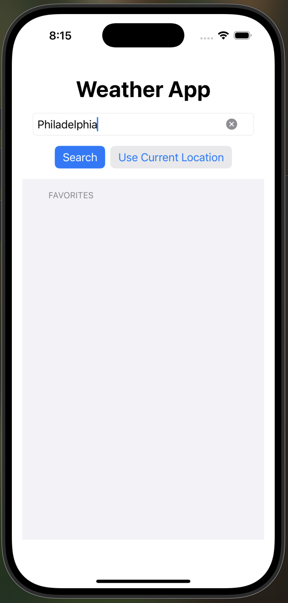
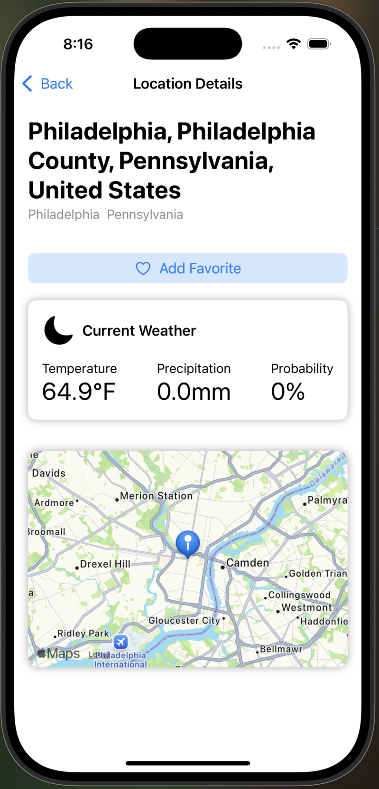
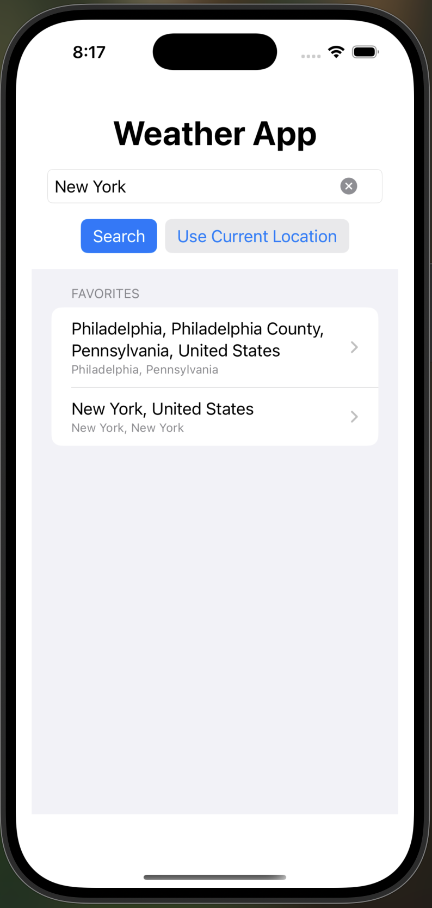
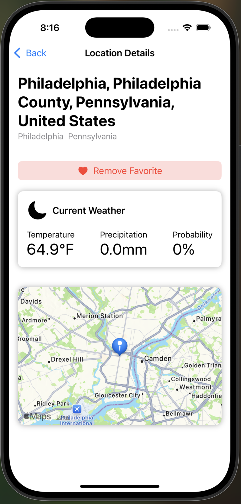
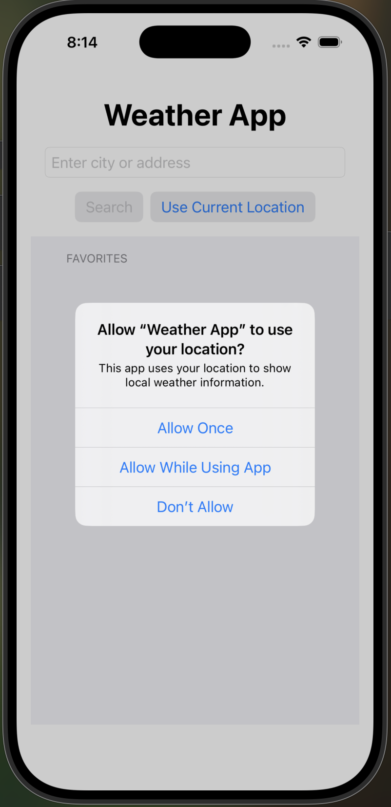

# Weather App  

A SwiftUI-based weather app that allows users to search for weather at any location using the Open Meteo and Nominatim APIs. Users can save their favorite locations, revisit them later, and even view current weather based on their device’s location. Demonstrates the use of API networking, Core Location, and persistent local storage.

---

## Features

### Search Locations

- Enter any city, address, or region in a text field to search for weather.  
- Uses Nominatim's geocoding API to convert search input into latitude/longitude.

  

---

### Current Weather Display + Map Integration

- Shows:
  - Temperature
  - Precipitation probability
  - Precipitation
- Weather data is fetched using Open Meteo's API based on coordinates.  
- A map is embedded in each location’s detail view, centered on the selected location.  
- Uses `CodingKeys` to map API field names to Swift-friendly ones.

  

---

### Favorites

- Users can favorite/unfavorite any location to revisit later.  
- Favorites are persistently stored on device (not using UserDefaults).  
- Users can navigate between all saved locations.

  
  

---

### Use Current Location

- Automatically fetch the user’s current location and get weather data for it.  
- Location permission priming is implemented with a `.sheet` to explain the need before system prompts.

  

---

## Screens

### Home View

- Text input field for searching locations.  
- Button to use current location.  
- List of favorited locations with navigation.

### Location Detail View

- Displays the official name of the location (from the geocoding API).  
- Weather summary for that location.  
- Embedded map view  
- Favorite/unfavorite toggle.

---

## APIs Used

- Nominatim (OpenStreetMap) – Geocoding  
  Converts input address strings into geographic coordinates.

- Open-Meteo – Weather  
  Returns hourly forecast data for a given lat/lon pair.

---

## Architecture

- **Models**
  - `Location`: Represents a location returned from the geocoding API (includes coordinates and address).
  - `WeatherInfo`: Represents weather data fetched from the Open Meteo API.

- **View Models**
  - `WeatherViewModel`: Manages app state, including favorited locations and persistent storage.
  - `LocationManager`: Handles Core Location and reverse geocoding for the current device location.
  - `APIService`: A service layer responsible for making asynchronous API calls and decoding responses (not a `ViewModel` by SwiftUI standards, but serves a similar logic-handling role).

- **Views**
  - `HomeView`: Input field, current location button, and list of favorites.
  - `LocationDetailView`: Displays weather for a selected location and allows favoriting.
  - `MapView`: Displays the location on a map, embedded in the detail view.

---

## How to Run

1. Open `WeatherApp.xcodeproj` in Xcode 15 on macOS Ventura.
2. Run on a simulator or real device.
3. Use the search bar to enter any location.
4. Use the “Use Current Location” button to auto-fill your device’s location.
